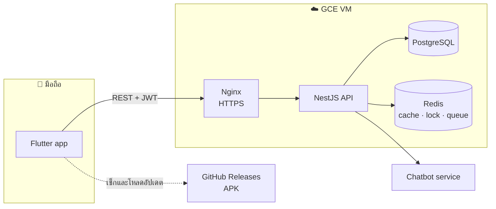
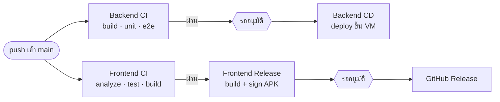

<div align="center">

# 🌲 Poonsuk Resort

**แอปจองห้องพัก พูนสุข รีสอร์ท @สะเดา**<br>
แอปมือถือ Flutter สำหรับลูกค้าและพนักงาน ทำงานกับ API ของรีสอร์ทจริง

[](https://github.com/PhonlawatThaenthong/tourist-booking-application/actions/workflows/backend-ci.yml)
[](https://github.com/PhonlawatThaenthong/tourist-booking-application/actions/workflows/frontend-ci.yml)
[](https://github.com/PhonlawatThaenthong/tourist-booking-application/actions/workflows/backend-cd.yml)
[](https://github.com/PhonlawatThaenthong/tourist-booking-application/actions/workflows/frontend-release.yml)

[**📱 ดาวน์โหลด APK ล่าสุด**](https://github.com/PhonlawatThaenthong/tourist-booking-application/releases/latest)

</div>

---

## สารบัญ

- [ฟีเจอร์](#ฟีเจอร์)
- [ภาพรวมระบบ](#ภาพรวมระบบ)
- [โครงสร้าง repo](#โครงสร้าง-repo)
- [เทคโนโลยี](#เทคโนโลยี)
- [รันในเครื่อง](#รันในเครื่อง)
- [เทส](#เทส)
- [CI/CD](#cicd)
- [ติดตั้งแอปบนมือถือ](#ติดตั้งแอปบนมือถือ)
- [เอกสารอื่น](#เอกสารอื่น)

---

## ฟีเจอร์

<table>
<tr>
<td width="50%" valign="top">

### 👤 ลูกค้า

- สมัครสมาชิก ล็อกอิน และรีเซ็ตรหัสผ่านทางอีเมล
- ค้นหาห้องว่างตามช่วงวัน เห็นห้องที่ถูกจองแล้วจากลูกค้าทุกคน
- ดูรายละเอียดห้อง รูป สิ่งอำนวยความสะดวก และราคา
- จองห้อง แล้วจ่ายผ่าน PromptPay QR พร้อมอัปโหลดสลิป
- ติดตามสถานะการจองและการชำระเงิน
- ร้านอาหารใกล้รีสอร์ท และแผนที่นำทาง
- แชตบอตตอบคำถามเกี่ยวกับรีสอร์ท

</td>
<td width="50%" valign="top">

### 🛎️ พนักงานและผู้ดูแล

- แดชบอร์ดรายได้ การจอง และอัตราเข้าพัก
- ปฏิทินการจองของทุกห้อง
- อนุมัติ เลื่อนวัน เช็คอิน และเช็คเอาท์
- ตรวจสลิปการโอน แล้วกดยืนยันหรือปฏิเสธ
- จัดการห้องพัก ราคา รูป และสถานะปิดปรับปรุง
- รายงานสถิติ
- admin จัดการบัญชีพนักงานได้

</td>
</tr>
</table>

**กันจองซ้ำ** ฐานข้อมูลมี exclusion constraint ไม่ให้ช่วงวันของห้องเดียวกันทับกัน และ API ล็อกต่อห้องผ่าน Redis ก่อนบันทึก
การจองที่ไม่จ่ายภายในเวลาที่กำหนดจะถูกยกเลิกเองเพื่อคืนห้อง

**อัปเดตในแอป** ตอนเปิดแอป แอปเช็ก GitHub Releases ถ้ามีเวอร์ชันใหม่จะชวนอัปเดต แล้วโหลดและเปิดหน้าติดตั้งให้

---

## ภาพรวมระบบ



---

## โครงสร้าง repo

```
.
├── backend/            NestJS API · TypeORM · PostgreSQL · Redis
│   ├── src/modules/    auth, rooms, bookings, payments, restaurants,
│   │                   reports, chatbot, notifications, mail, cache, health
│   ├── src/migrations/ ทุกการเปลี่ยน schema ต้องเป็น migration
│   ├── src/database/   สคริปต์ seed ห้อง ร้านอาหาร และสร้าง admin
│   └── test/           e2e tests (รันกับ Postgres + Redis จริง)
├── frontend/           Flutter app (flutter_bloc)
│   ├── lib/blocs/      state ของแต่ละหน้า
│   ├── lib/repositories/api/  ตัวเรียก API
│   ├── lib/screens/    customer/ · admin/ · auth/
│   ├── test/           unit + widget tests
│   └── patrol_test/    e2e บนอุปกรณ์จริง (Patrol)
├── deploy/             คู่มือและสคริปต์ deploy ขึ้น Google Cloud
└── .github/workflows/  CI/CD
```

---

## เทคโนโลยี

| ส่วน | ใช้อะไร |
|---|---|
| แอปมือถือ | Flutter · Dart · flutter_bloc · Sentry · ota_update |
| API | NestJS 10 · TypeORM · class-validator · Passport JWT |
| ฐานข้อมูล | PostgreSQL 16 |
| Cache, lock, queue | Redis 7 · BullMQ |
| ชำระเงิน | PromptPay QR + อัปโหลดสลิป ให้พนักงานยืนยัน |
| Infrastructure | Docker Compose · Nginx · Let's Encrypt · Google Compute Engine |
| CI/CD | GitHub Actions · Artifact Registry · Workload Identity Federation |

---

## รันในเครื่อง

ต้องมี **Node.js 20+**, **Docker Desktop** และ **Flutter SDK** (stable)

### 1. Backend

สร้างไฟล์ `backend/.env` ไฟล์นี้ไม่อยู่ใน git ค่าด้านล่างใช้สำหรับเครื่องตัวเองเท่านั้น

<details>
<summary><b>ตัวอย่าง <code>backend/.env</code></b></summary>

```dotenv
NODE_ENV=development
PORT=3000

# docker compose เปิด Postgres ที่พอร์ต 5433 บนเครื่อง
DB_HOST=localhost
DB_PORT=5433
DB_USER=poonsuk
DB_PASSWORD=poonsuk_dev_password
DB_NAME=poonsuk

# docker-compose.yml บังคับให้ตั้งรหัส Redis
REDIS_PASSWORD=poonsuk_dev_redis
REDIS_URL=redis://:poonsuk_dev_redis@localhost:6379

JWT_ACCESS_SECRET=change-me-access-secret
JWT_ACCESS_TTL=15m
JWT_REFRESH_SECRET=change-me-refresh-secret
JWT_REFRESH_TTL_DAYS=30

UPLOAD_DIR=./uploads
PAYMENT_ACCOUNT_NAME=Poonsuk Resort
PAYMENT_PROMPTPAY_ID=<PromptPay ID>
PAYMENT_NOTE=สแกน QR แล้วโอนตามยอดการจอง จากนั้นอัปโหลดสลิปเพื่อรอเจ้าหน้าที่ยืนยัน
PAYMENT_MAX_SLIP_BYTES=5242880

# นาทีที่การจองที่ยังไม่จ่ายถือห้องไว้ก่อนถูกยกเลิกอัตโนมัติ
BOOKING_HOLD_MINUTES=3

# ไม่ตั้ง SMTP_HOST = รหัสรีเซ็ตรหัสผ่านจะแสดงใน log แทนการส่งอีเมล
# SMTP_HOST=
# CHATBOT_URL=
```

</details>

```bash
cd backend
npm install
docker compose up -d postgres redis
npm run migration:run
npm run seed:rooms
npm run seed:restaurants
npm run start:dev          # http://localhost:3000
```

สร้างบัญชี admin คนแรก รหัสผ่านต้องยาวอย่างน้อย 12 ตัวอักษร

```powershell
$env:SEED_ADMIN_EMAIL="you@example.com"; $env:SEED_ADMIN_PASSWORD="<strong password>"
npm run seed:admin
```

เช็กว่า API พร้อม: `curl http://localhost:3000/health/ready`

### 2. Frontend

```bash
cd frontend
flutter pub get

# เปิดในเบราว์เซอร์ แล้วเข้า http://localhost:8081
flutter run -d web-server --web-port=8081

# Android emulator มองเครื่องตัวเองเป็น 10.0.2.2
flutter run --dart-define=API_BASE_URL=http://10.0.2.2:3000
```

ค่าเริ่มต้นแอปเรียก API ที่ `http://localhost:3000` ถ้าใช้มือถือจริง ให้ใส่ IP ของเครื่องใน `API_BASE_URL`

---

## เทส

| ชุด | คำสั่ง | ต้องมี |
|---|---|---|
| Backend unit | `cd backend && npm test` | — |
| Backend e2e | `cd backend && npm run test:e2e` | Postgres + Redis |
| Flutter unit + widget | `cd frontend && flutter test` | — |
| Flutter lint | `cd frontend && flutter analyze` | — |
| Patrol e2e | `cd frontend && patrol test --dart-define=API_BASE_URL=http://10.0.2.2:3000` | emulator + backend ที่รันอยู่ |

Patrol ยังไม่ได้รันใน CI

---

## CI/CD



| Workflow | ทำงานเมื่อ | ทำอะไร |
|---|---|---|
| 0 | Repository abstraction in the Flutter app | done |
| 1 | Backend auth vertical slice | done |
| 2 | Rooms + bookings, double-booking prevention | done |
| 3 | Flutter switches to the real API | done |
| 4 | Redis, BullMQ, payments, load balancing, observability | partial: Redis, BullMQ, payments, Nginx and Sentry done; single API instance, no load balancing yet |
=======
| **Backend CI** | push ที่แก้ `backend/` ทุก branch และ PR เข้า `main` | build, unit test, e2e test กับ Postgres + Redis |
| **Backend CD** | Backend CI ผ่านบน `main` | build Docker image แล้ว deploy ขึ้น VM รัน migration และ health check ถ้าไม่ผ่านจะย้อนกลับเวอร์ชันเดิม |
| **Frontend CI** | push ที่แก้ `frontend/` ทุก branch และ PR เข้า `main` | `flutter analyze`, `flutter test`, build APK |
| **Frontend Release** | Frontend CI ผ่านบน `main` | build และ sign APK แล้วปล่อยเป็น GitHub Release |

**ต้องอนุมัติก่อนขึ้นจริง** ทั้ง Backend CD และ Frontend Release ใช้ environment `production` ซึ่งต้องให้ผู้อนุมัติกด **Review deployments → Approve** ในหน้า Actions ก่อน
ก่อนอนุมัติ release แอป โหลด APK มาลองได้จาก Artifacts ชื่อ `release-apk` ในหน้า run

**เลขเวอร์ชัน** release ชื่อ `v<version>-build.<N>` เช่น `v1.0.0-build.5`
`<version>` มาจาก `version:` ใน `frontend/pubspec.yaml` ส่วน `<N>` เพิ่มเองทุกรอบ แอปแสดงเลขเดียวกันในหน้า Profile

**Signing key** APK ทุกตัว sign ด้วย key ถาวรตัวเดียว เก็บใน GitHub Secrets ถ้า key หาย จะออกอัปเดตทับแอปเดิมไม่ได้อีก
รายละเอียดอยู่หัวไฟล์ [`frontend-release.yml`](.github/workflows/frontend-release.yml)

ตัวแปรและ secrets ที่ workflow ใช้ ตั้งที่ **Settings → Secrets and variables → Actions** ดูรายการเต็มใน [`deploy/README.md`](deploy/README.md) หัวข้อ 9

---

## ติดตั้งแอปบนมือถือ

1. เปิด [หน้า Release ล่าสุด](https://github.com/PhonlawatThaenthong/tourist-booking-application/releases/latest) บนมือถือ Android
2. กดไฟล์ `.apk` ใต้หัวข้อ **Assets**
3. อนุญาต "ติดตั้งแอปที่ไม่รู้จัก" ครั้งแรก แล้วกดติดตั้ง

หลังจากนั้นแอปจะชวนอัปเดตเองเมื่อมีเวอร์ชันใหม่ ข้อมูลและการล็อกอินยังอยู่หลังอัปเดต

---

## เอกสารอื่น

| เอกสาร | เนื้อหา |
|---|---|
| [`deploy/README.md`](deploy/README.md) | ตั้งค่า Google Cloud, VM, Nginx, HTTPS, GitHub และงานประจำ เช่น ดู log และ rollback |
| [`backend/README.md`](backend/README.md) | endpoint และข้อตกลงในโค้ด backend |
| [`frontend/README.md`](frontend/README.md) | รายละเอียดแอป Flutter |
